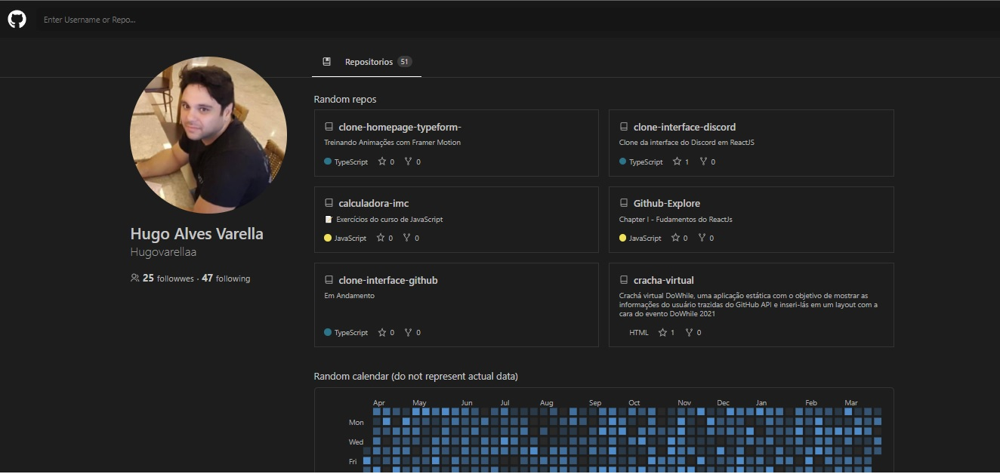
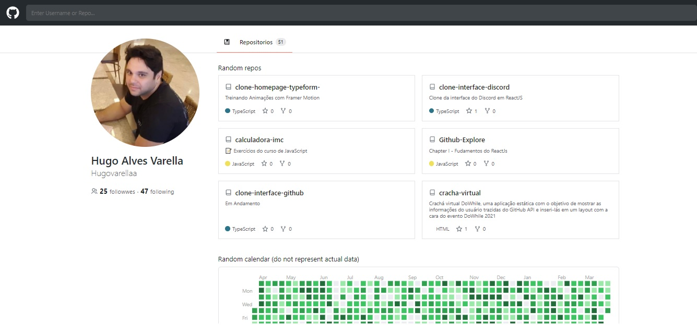

# Clone UI Github 💜

&nbsp;

<div>
  
  
</div>

<br/>

## 📚 Informações sobre o projeto

- Esse projeto foi desenvolvido durante uma Aula do Guilherme Rodz, na plataforma youtube no canal da Rocketseat

&nbsp;

## 💻 O que tem no projeto?

- Clone da interface do Github.
- Dark Mode e Light mode.
- Consumo e uso da API do github.
- Buscar de usuario na barra de pesquisa do header.
- Roteamento das paginas.
- Interface Responsiva e Dinamica.

&nbsp;
&nbsp;

## 🛠️ Tecnologias/Ferramentas ultilizadas

- [React](https://pt-br.reactjs.org/E)
- [TypeScript](https://www.typescriptlang.org/)
- [styled-components](https://styled-components.com/)
- [react-icons](https://react-icons.github.io/react-icons/)
- [react-router-dom](https://www.npmjs.com/package/react-router-dom)
- [react-calendar-heatmap](https://www.npmjs.com/package/react-calendar-heatmap)
- [date-fns](https://date-fns.org/)

## ⚙️ Instalação

```
# Abra um terminal e copie este repositório com o comando
$ git clone https://github.com/Hugovarellaa/clone-interface-github
```

```
# Acesse a pasta da aplicação
$ cd clone-interface-github

# Instale as dependências
$ yarn

# Inicie a aplicação
$ yarn start

```

---

<p align="center">Feito com 💙 por Hugo Alves Varella</p>
